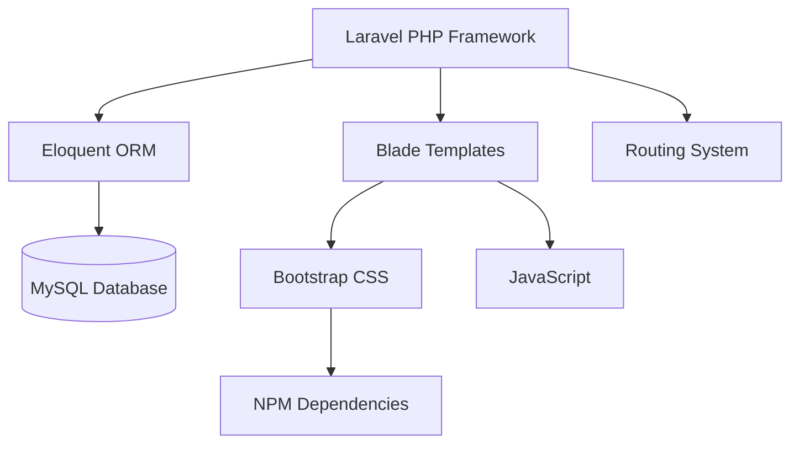

# 🎓 Another News Management System - Laravel

<div align="center">


[](https://github.com/yourusername/student-management-laravel)
[](https://github.com/yourusername/student-management-laravel)
[](https://php.net)
[](https://laravel.com)

**A simple news management system built with Laravel for the Backend Frameworks college subject**

[✨ Features](#-features) •
[🛠️ Tech Stack](#️-tech-stack) •
[🚀 Local Setup](#-local-setup) •
[📋 API Endpoints](#-api-endpoints) •
[📚 Learning Notes](#-learning-notes)

</div>

---

## 📖 About The Project

This project was developed as part of my **Backend Frameworks** college subject. It's a simple CRUD application for managing news, built with Laravel to understand MVC architecture, routing, Eloquent ORM, and basic frontend integration.

> 🧪 **Academic Purpose Only**  
> This is a learning project created to understand Laravel fundamentals. It may contain beginner mistakes and is not intended for production use.

---
## 🛠️ Tech Stack



| Layer | Technology | Purpose |
|-------|------------|---------|
| **Backend** |  | Server-side logic |
| **Framework** |  | MVC architecture |
| **Database** |  | Data persistence |
| **Frontend** |  | Responsive UI |
| **Package Manager** |  | Frontend dependencies |

---

## 🚀 Local Setup

### 📋 Prerequisites

- PHP 8.1+
- Composer
- MySQL
- Node.js & NPM
- Laravel CLI (optional)

### ⚡ Quick Installation

```bash
# 1. Clone the repository
git clone https://github.com/yourusername/student-management-laravel.git
cd student-management-laravel

# 2. Install PHP dependencies
composer install

# 3. Install JavaScript dependencies
npm install

# 4. Create environment file
cp .env.example .env

# 5. Generate application key
php artisan key:generate

# 6. Configure database in .env file
# Edit .env with your database credentials

# 7. Run migrations
php artisan migrate

# 8. (Optional) Seed dummy data
php artisan db:seed

# 9. Build frontend assets
npm run build
# OR for development with hot reload:
npm run dev

# 10. Start the development server
php artisan serve
```

🎉 **Your application is now running at** `http://localhost:8000`

---

## 🚦 Development Commands

```bash
# PHP/Laravel Commands
php artisan serve              # Start development server
php artisan migrate            # Run migrations
php artisan migrate:fresh      # Fresh migration (reset DB)
php artisan db:seed            # Run seeders
php artisan tinker             # Interactive shell
php artisan route:list         # List all routes

# NPM Commands
npm install                    # Install dependencies
npm run dev                    # Development build with hot reload
npm run build                  # Production build
npm run watch                  # Watch for changes
```

---

## 📝 What I Learned

> **"This project helped me understand how MVC frameworks structure web applications and how Laravel simplifies common backend tasks like routing, database interactions, and form validation."**

- ✅ How to structure a Laravel application
- ✅ Working with Eloquent ORM instead of raw SQL
- ✅ Blade templating for dynamic views
- ✅ Form handling and validation
- ✅ Database migrations for version control
- ✅ Relationships between models
- ✅ Authentication basics

---

## 🔮 Future Improvements (If I Continue)

- [ ] Add user authentication (Laravel Breeze/Jetstream)
- [ ] Implement API endpoints with Laravel Sanctum
- [ ] Add file upload for articles
- [ ] Implement search filters
- [ ] Export data to PDF/Excel
- [ ] Add unit tests

---

## 📄 License

This project is for **educational purposes only** as part of a college assignment.

---

## 🙏 Acknowledgments

- My Backend Frameworks professor
- [Laravel Documentation](https://laravel.com/docs)
- [Laracasts](https://laracasts.com) tutorials
- Stack Overflow community

---

<div align="center">

### ⭐ If this helped you understand Laravel basics, give it a star!

**Made with 💙 for learning Laravel**

</div>
